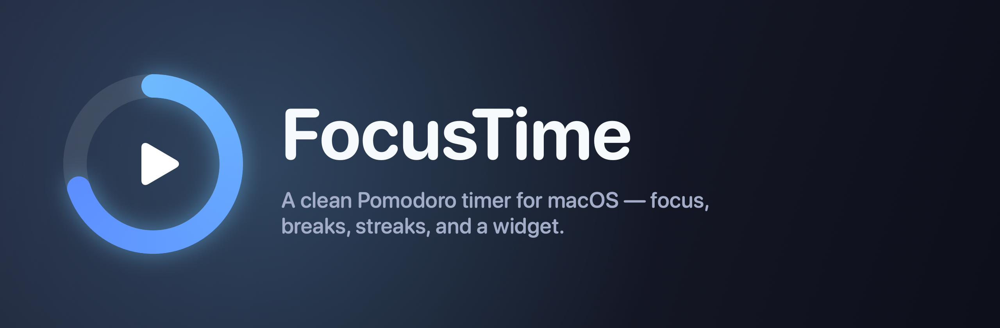

<p align="center">
  
</p>

<p align="center">
  A clean, native <b>Pomodoro timer</b> for macOS — a small floating window plus a glanceable widget.
</p>

<p align="center">
  
  
  
</p>

---

## Overview

FocusTime is a minimal, offline focus timer. It lives in a compact square window that floats in the corner of your screen, runs alternating **focus** and **break** sessions, and tracks your daily focus time, session count, and streak. A WidgetKit widget shows the same stats at a glance on your desktop or Notification Center.

The whole interface is drawn in SwiftUI — a smooth progress ring, clean rounded typography, and tactile native controls — with no external assets to manage.

## Features

- **Focus / break cycles** with a smooth animated progress ring
- **Daily stats** — focus time, completed sessions, and a day streak
- **Home Screen widget** (small + medium) sharing live stats via an App Group
- **Floating window** that stays out of the way, pinned to your preferred corner
- **Adjustable durations**, end-of-session sound, reduce-motion, and corner placement
- **100% offline** — data is stored locally in `UserDefaults`, nothing leaves your Mac

## Getting started

**Requirements:** macOS 14+ and Xcode 16+.

```bash
git clone <your-repo-url>
cd FocusTime
open FocusTime.xcodeproj
```

In Xcode:

1. Select the **FocusTime** scheme.
2. Set your **Team** under *Signing & Capabilities* for both the `FocusTime` and `FocusTimeWidget` targets (automatic signing is fine).
3. Press **⌘R** to build and run.

To add the widget, right-click your desktop or open Notification Center → **Edit Widgets** → search for **FocusTime**.

## Project structure

```
FocusTime/
├─ FocusTime/                    App target
│  ├─ FocusTimeApp.swift         App entry + scenes
│  ├─ AppDelegate.swift          Floating-window behavior
│  ├─ ContentView.swift          Window shell + background
│  ├─ TimerView.swift            Ring, time, and controls
│  ├─ SettingsView.swift         Preferences
│  ├─ FocusTimerViewModel.swift  Timer state & phase logic
│  └─ Shared/                    Code shared with the widget
│     ├─ Models.swift            Settings, phases, snapshots
│     ├─ DataStore.swift         App Group persistence
│     ├─ RingView.swift          Smooth progress ring
│     ├─ Theme.swift             Colors, type, button style
│     ├─ Keys.swift              Storage keys + window metrics
│     └─ Formatters.swift        Time/date formatting
└─ FocusTimeWidget/              Widget extension
```

State is shared between the app and widget through the App Group `group.com.focustime.focustime`. The view model commits focus progress on a checkpoint interval and on phase completion, then asks WidgetKit to reload.

## Architecture

- **MVVM** — `FocusTimerViewModel` owns all timer state; views observe it.
- **Shared core** — everything in `Shared/` compiles into both the app and the widget.
- **AppKit where needed** — `AppDelegate` + `WindowAccessor` configure the borderless, floating, corner-pinned window that SwiftUI alone can't express.

## Roadmap

- [ ] Menu-bar / `LSUIElement` mode (no Dock icon)
- [ ] Optional long-break after N sessions
- [ ] Weekly stats view
- [ ] Customizable accent themes

## License

MIT — see [`LICENSE`](LICENSE).
